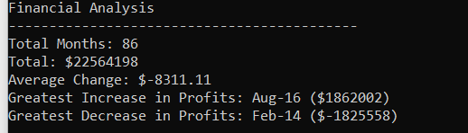
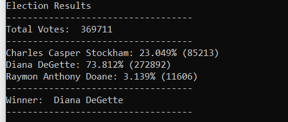

# python-challenge
week 3 - Python Homework
## PyBank
In order to analyse Financial Records for the company, a CSV file with a columns of "Date" and "Profit/Loss" figures must be saved to the **pyBank\Resources** directory. 
Once the data is downloaded and saved, run script `main.py` located in the **pyBank** folder where it will print a summary to the terminal as well as a summarised text file outputted to **pyBank\analysis**

### Output example

[budget_analysis.txt](pybank/analysis/budget_analysis.txt)

## PyPoll
Similarly, in order to analyse poll data, a CSV file with columns of "Voter ID", "County", and "Candidate" must be downloaded and saved to the **pyPoll\Resources** directory.
Once the data is downloaded and saved, run script `main.py` location directly in folder **pyPoll** where it will print a summary to the terminal as well as a summarised text file outputted to **pyPoll\analysis** 

### Output example

[election_analysis.txt](PyPoll/analysis/election_analysis.txt)
